# 📌 AttenSense – Real-Time Attention Tracking System

**Problem Statement:** Accurately measure and analyze a user's attention span during video sessions using real-time computer vision.

---

## 🎯 Objectives

- 🔍 Develop a real-time attention tracking system.
- 🧠 Implement facial, head pose and gaze detection.
- 📊 Create attention metrics and visual analytics.

---

## 🛠️ Tech Stack

**Languages & Libraries**
- Python
- OpenCV, MediaPipe
- NumPy, Pandas
- Streamlit (Frontend)
- FastAPI (Backend)
- SQLite (Database)

**Computer Vision**
- Face Detection (MediaPipe)
- Phone Detection (YOLOv8n)
- Gaze, EAR, and Head Pose Estimation (MediaPipe Face Mesh)

---

## 🧠 How It Works

### 🎥 Video Input Handling
- **Live Video** via webcam (processed at 10 FPS).
- **Uploaded Video** (processed frame-by-frame).

### 🧠 Focus Detection Pipeline
1. **Face Detection**  
   - Detect face using MediaPipe.
2. **Phone Detection**  
   - Run YOLOv8n object detection if face is detected.
3. **Focus Analysis**  
   - Head Pose (yaw & pitch angle evaluation)  
   - Eye Aspect Ratio (EAR) to check if eyes are closed  
   - Gaze Tracking based on pupil movement
   > All made possible using MediaPipe's 468 facial landmarks

### 📊 Session Data Aggregation
- Frame-wise focus state is grouped by timestamp and state.
- Final result: `Start time`, `End time`, `Duration`, `Focus State`
- Data is saved in CSV and/or stored in SQLite.

---

## 🌐 Frontend (Streamlit)

- 📸 Live camera feed or video upload support.
- 📈 Real-time analytics (Altair chart of Focused vs Not Focused).
- ⏱️ Key Metrics:
  - Total Duration
  - Focused Duration
  - Unfocused Duration
  - Focus %  
- 📂 Export CSV Report  
- 🔍 Session Search by Name / ID  
- 🧾 View previous session analytics with visualizations.

---

## 🔙 Backend (FastAPI)

- `POST /atten-sense/api/v1/upload-image/`  
  → Predicts **focus_state** and **reason** for a static image.

- `POST /atten-sense/api/v1/upload-video/`  
  → Returns session data: `start`, `end`, `focus_state`.

---

## 💾 Data Storage

- Focus session data is stored in a **SQLite** database.
- Each session gets a **unique session ID** for tracking and querying.

---

## 📷 Suggested Images for README

1. **Landing Page**  
   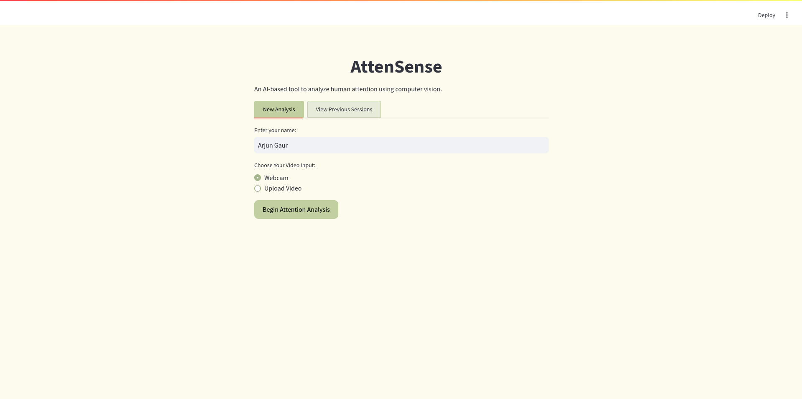

2. **Demo: Live Video Feed**  
   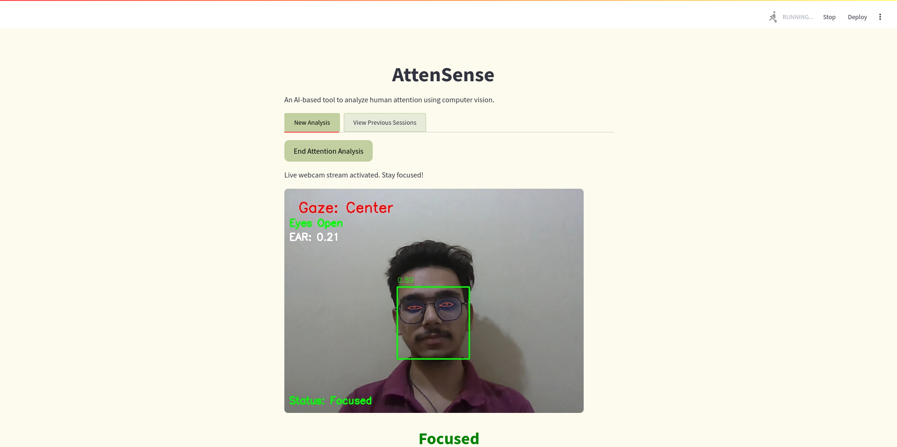
   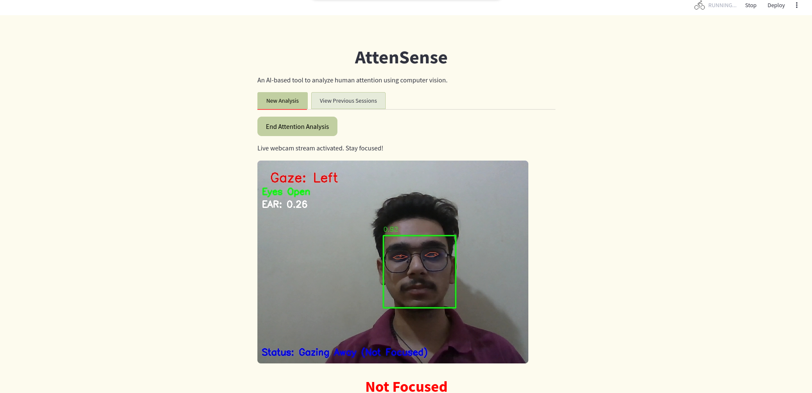
   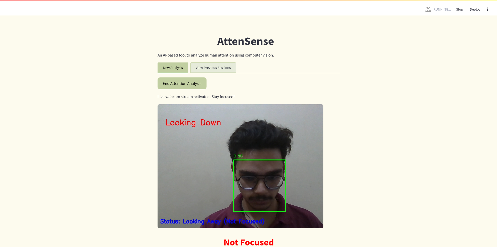
   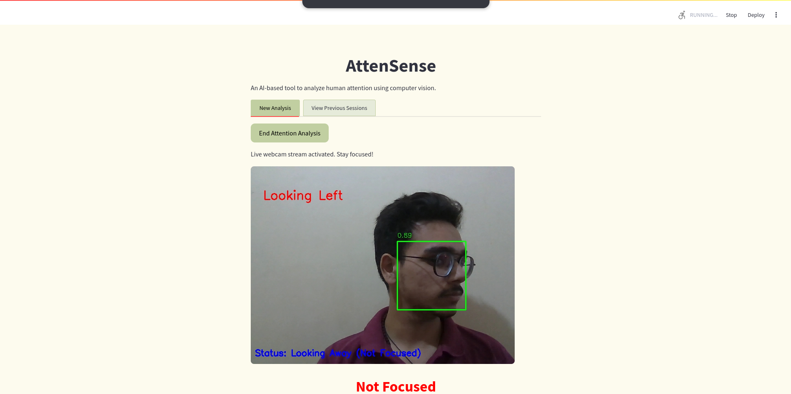
   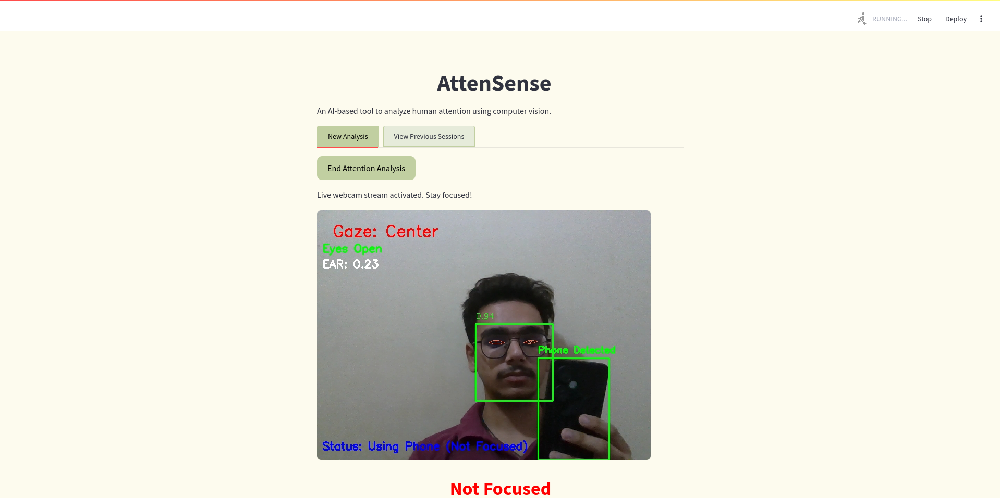

3. **Session Report**  
   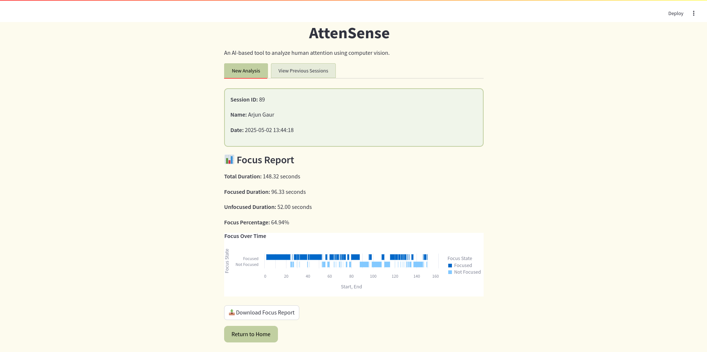

4. **CSV Output Preview**  
   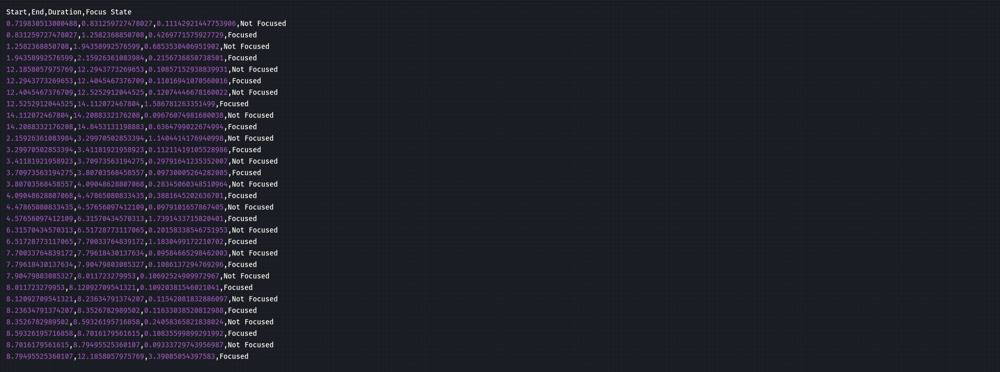

5. **Streamlit UI**  
   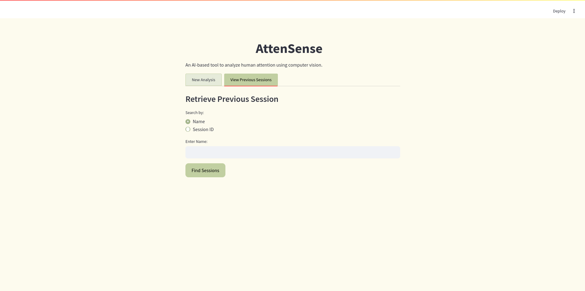
   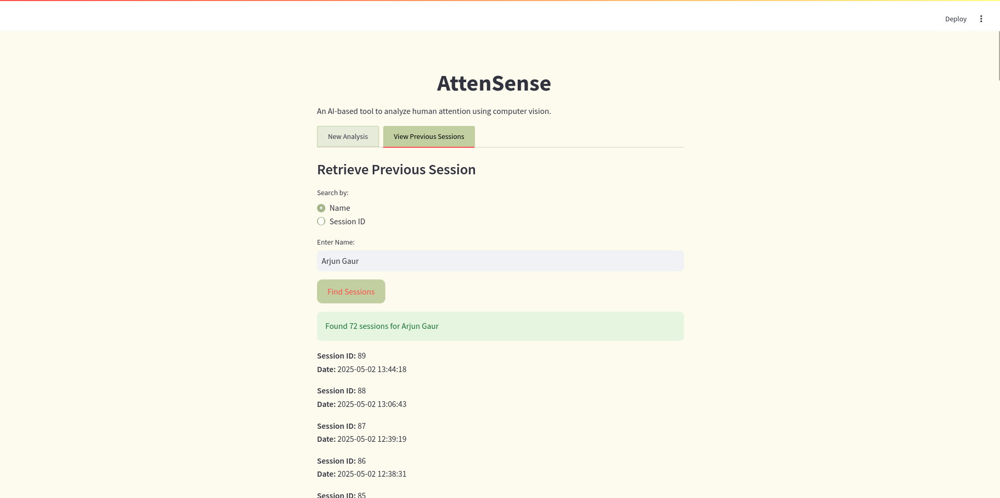
   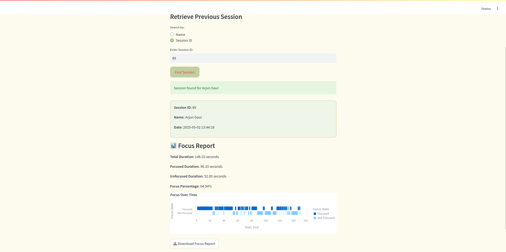

6. **API Request Sample**  
   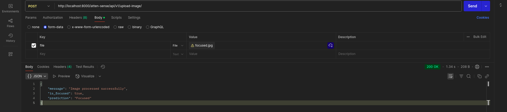
   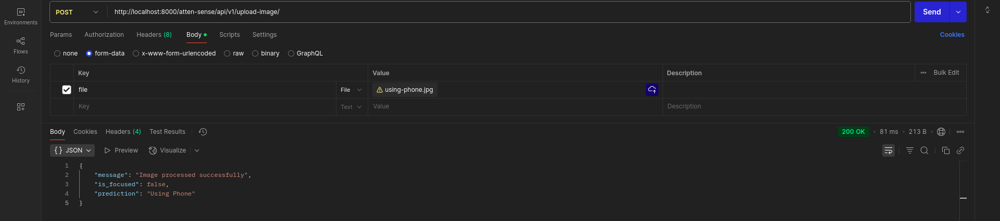
   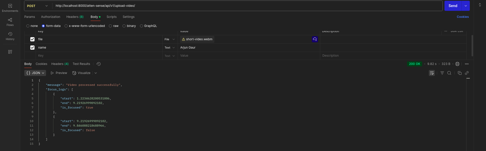

---

## 🚀 Getting Started

```bash
# Clone the repo
git clone https://github.com/Arj0n-G0d/atten-sense.git
cd atten-sense

# (Recommended) Create virtual environment
python -m venv venv
source venv/bin/activate  # or venv\Scripts\activate on Windows

# Install requirements
pip install -r requirements.txt

# Run frontend
streamlit run app.py

# Run backend
uvicorn server:app --reload
